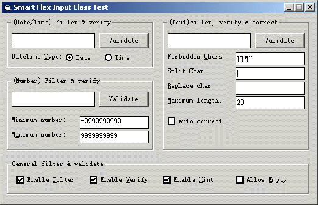



## Smart Flex Input

### Description

Ever too tired to control user's input? Ever want to control maxlength of a combobox? Ever want to validate and correct and hint(optional) user's input automatically?

This is what you need to control user's input with textbox, combox etc.

I am working on it and have figured out many improvements that can be done if you are so kind to rate it!

Any comment or vote is appreciated!

Please vote for it if you guys desire a much better version :-)
 
### More Info
 
It supports input ranges like the "case" in "select case", for example, 3-8,a-v, etc.

             |
---                |---
**Submitted On**   |2002-02-27 12:14:12
**By**             |[enmity](https://github.com/Planet-Source-Code/PSCIndex/blob/master/ByAuthor/enmity.md)
**Level**          |Advanced
**User Rating**    |5.0 (25 globes from 5 users)
**Compatibility**  |VB 4\.0 \(32\-bit\), VB 5\.0, VB 6\.0
**Category**       |[String Manipulation](https://github.com/Planet-Source-Code/PSCIndex/blob/master/ByCategory/string-manipulation__1-5.md)
**World**          |[Visual Basic](https://github.com/Planet-Source-Code/PSCIndex/blob/master/ByWorld/visual-basic.md)
**Archive File**   |[Smart\_Flex581782272002\.zip](https://github.com/Planet-Source-Code/enmity-smart-flex-input__1-32174/archive/master.zip)

